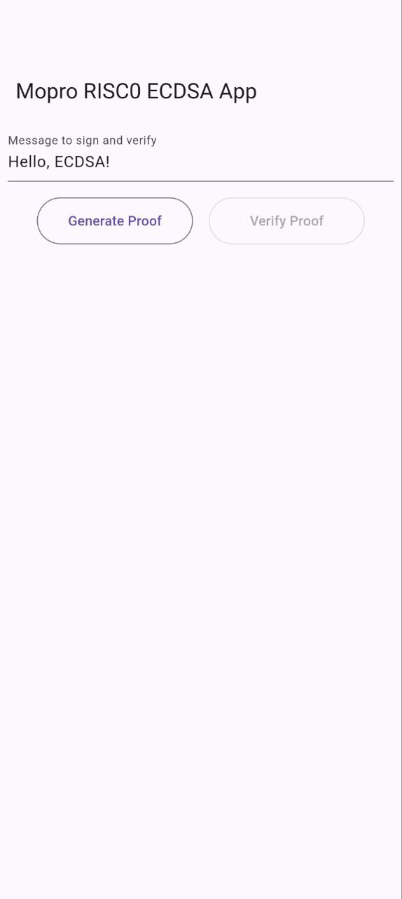
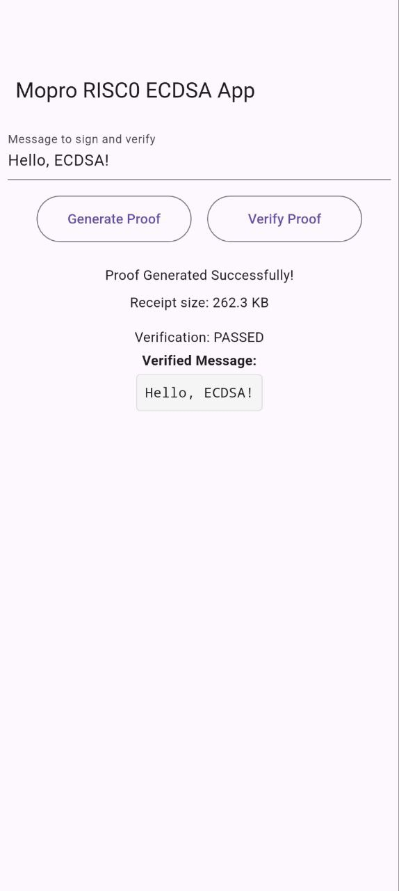

# RISC0 ECDSA + Mopro Example App

Flutter app demonstrating RISC0 zkVM ECDSA signature verification with zero-knowledge proofs on mobile devices using Mopro.

This app generates and verifies zero-knowledge proofs that validate ECDSA signature verification without revealing the private key or signature details.

## Architecture

```
├── risc0-circuit/          # RISC0 zkVM ECDSA circuit
│   ├── src/main.rs         # Host program (ECDSA proof generation)
│   └── methods/guest/      # Guest program (ECDSA verification in zkVM)
├── mopro-r0-example-app/   # Mopro FFI bindings
│   ├── src/lib.rs          # UniFFI exports for mobile (ECDSA functions)
│   └── flutter/            # Flutter app with ECDSA UI
└── Cargo.toml              # Rust workspace configuration
```

## App Demo
Mopro RISC0 ECDSA App demo running live on Pixel 10 Pro

<div align="center">

|  Message Input & Proof Generation |  ECDSA Proof Verification  |
|:-------------------------:|:---------------------:|
|  |  |

</div>

## Prerequisites

Install required tools:

```bash
# Install the latest Mopro CLI
git clone git@github.com:zkmopro/mopro.git
cd cli && cargo install --path .

# Install Flutter SDK
# See: https://flutter.dev/docs/get-started/install

# Verify installation
mopro --version
flutter --version
```

## Quick Start

1. **Clone and setup**:
```bash
# Clone this ECDSA example repository
cd mopro-r0-ecdsa-app/mopro-r0-example-app
```

2. **Build native bindings**:
```bash
mopro build
```

3. **Update bindings**:
```bash
mopro update
```

6. **Run Flutter app**:
```bash
cd flutter
flutter pub get
flutter run

# Run `flutter emulator` to check available one if you want to run on PC first
```

## Development Commands

### ECDSA Circuit Development
The RISC0 circuit implements ECDSA signature verification using secp256r1 elliptic curve cryptography. For more RISC0 examples, refer to [risc0/examples](https://github.com/risc0/risc0/tree/main/examples).

**`risc0-circuit/`**: Contains ECDSA verification program
- `src/main.rs`: Host code that generates ECDSA proofs
- `methods/guest/src/main.rs`: Guest code that verifies ECDSA signatures in zkVM

```bash
# Run RISC0 ECDSA host program directly
cd risc0-circuit && cargo run

# Run with execution logs
RUST_LOG="[executor]=info" RISC0_DEV_MODE=1 cargo run
```

### Key Components
- **secp256r1 Curve**: Industry-standard elliptic curve used in many systems
- **Random Key Generation**: Each proof uses a fresh keypair for security
- **Message Signing**: Input messages are signed with ECDSA
- **ZK Verification**: Proofs verify signature validity without revealing keys

### Mobile Development
For customizing your RISC0 ECDSA program with Mopro, refer to [Mopro Docs](https://zkmopro.org/docs/setup/rust-setup#-customize-the-bindings).

**`mopro-r0-example-app/`**: FFI bindings and mobile integration
- `src/lib.rs`: Exported ECDSA functions for mobile apps
  - `risc0_prove(message: String)` - Generate ECDSA proof for message
  - `risc0_verify(receipt: Vec<u8>)` - Verify ECDSA proof and extract message
- `flutter/`: Flutter app with ECDSA UI

```bash
# Run ECDSA tests
cargo test      # Includes ECDSA prove/verify integration tests

# Test different message types
cargo test test_prove_verify_roundtrip  # Tests various message formats

# Rebuild after Rust changes
mopro build && mopro update
```

### API Reference

#### `risc0_prove(message: String) -> Result<Risc0ProofOutput, Risc0Error>`
Generates a zero-knowledge proof that validates ECDSA signature verification for the given message.
- **Input**: Any UTF-8 string message
- **Output**: Serialized receipt containing the proof
- **Process**: Generates random secp256r1 keypair, signs message, creates ZK proof

#### `risc0_verify(receipt_bytes: Vec<u8>) -> Result<Risc0VerifyOutput, Risc0Error>`
Verifies a RISC0 ECDSA proof and extracts the verified message.
- **Input**: Serialized proof receipt bytes
- **Output**: Verification result with original message
- **Validation**: Confirms proof validity and extracts verified message
